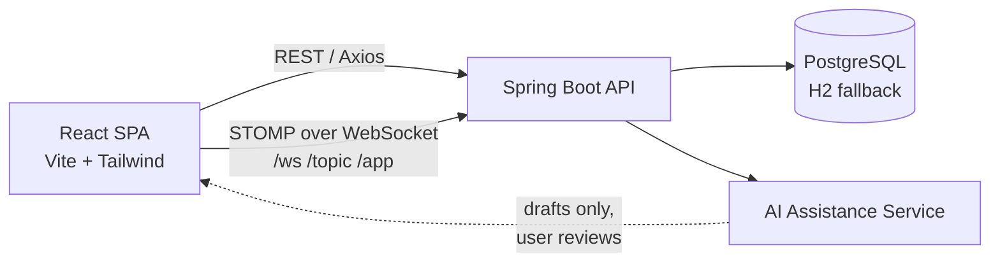

<div align="center">

# 💬 ConnectAI — AI Integrated People Chat Application

*"Human conversations, intelligently assisted."*


</div>

---

**Major Academic Project (2026–2027)**
Department of Information Technology, Ajay Kumar Garg Engineering College (AKGEC), Ghaziabad

| | |
|---|---|
| **Team** | Abdul Mannan, Aditya Maurya, Aditya Vishwakarma, Abhishek Gangwar |
| **Project Guide / Mentor** | Mr. Sudhakar Dwivedi |

---

## 🌟 Project Concept & Core Value

ConnectAI is a modern, full-stack real-time communication platform built **for people to talk with people**, enhanced by an unobtrusive, human-centered **AI Assistance Layer**.

### 🔒 Human-in-the-Loop Safeguard (Core Design Principle)

- **AI never impersonates users** — AI is not a bot in the chat room; it only assists human senders.
- **Explicit review before sending** — all smart suggestions, translations, tone rewrites, and summaries are generated as drafts that the user must review, edit, insert, or reject.
- **Visual separation** — AI-generated suggestions are clearly distinguished from sent human messages.

## 🚀 Key Features

### 💬 Real-Time Human Chat

- **1-on-1 direct messaging** with dynamic thread creation and online presence detection
- **Group channels** with multi-user creation, admin roles, and member management
- **Rich media & voice** — high-fidelity voice notes with an audio player, and photo sharing with a modal lightbox
- **Emoji reactions & receipts** — multi-emoji reactions, sent/delivered/read receipts, and live typing indicators

### 🤖 AI Assistance Suite

| # | Feature | Description |
|---|---------|-------------|
| 1 | **Contextual Smart Replies** | 3 instant response chips tailored to the conversation context |
| 2 | **Multi-Tone Message Rewrite** | 6 expressive tones: *Professional, Casual, Polite, Concise, Expanded, Academic* |
| 3 | **Live Translation** | Instant translation between English, Hindi, Spanish, French, German, Japanese, Arabic, Russian, and Portuguese |
| 4 | **Conversation Digest & Summaries** | Multi-message summarization with bullet points and action items |
| 5 | **Content Safety & Moderation** | Proactive screening for toxic phrasing, with polite alternative suggestions |

## 🏗️ Architecture



## 🛠️ Technology Stack

### Backend

| Layer | Technology |
|-------|------------|
| Language & Runtime | Java 17+, Spring Boot 3.2+ |
| Security | Spring Security 6, JJWT (`0.11.5`), BCrypt password hashing, Google OAuth 2.0 |
| Data & ORM | Spring Data JPA, Hibernate, PostgreSQL (production) + H2 in-memory fallback |
| Real-Time | Spring WebSocket STOMP message broker (`/ws`, `/topic`, `/app`) |
| Validation & Tools | Jakarta Validation, Lombok |

### Frontend

| Layer | Technology |
|-------|------------|
| Framework | React 18, Vite |
| Styling | Tailwind CSS / modern CSS variables (dark & light theme support) |
| Icons | Lucide React |
| Routing | React Router DOM v6 |
| Real-Time | WebSocket STOMP client with Server-Sent Events (SSE) fallback |

## 📂 Project Structure

```
beautiful-lovelace/
├── backend/
│   ├── pom.xml
│   └── src/
│       └── main/
│           ├── java/com/connectai/
│           │   ├── ConnectAiApplication.java
│           │   ├── config/              # Security, CORS, WebSocket, DataInitializer
│           │   ├── controller/          # REST controllers (Auth, User, Chat, Group, AI, Notif)
│           │   ├── dto/                 # Request/response data transfer objects
│           │   ├── entity/              # JPA entities (User, Conversation, Message, etc.)
│           │   ├── exception/           # Global exception handling & error responses
│           │   ├── repository/          # Spring Data JPA repositories
│           │   ├── security/            # JWT token service & authentication filters
│           │   ├── service/             # Business logic & AI suite implementations
│           │   └── websocket/           # STOMP message handlers & event listeners
│           └── resources/
│               ├── application.yml      # Dual DB config (PostgreSQL + H2 fallback)
│               └── application-example.yml
├── frontend/
│   ├── package.json
│   ├── vite.config.js
│   ├── standalone-preview.html          # Single-bundle presentation UI
│   └── src/
│       ├── App.jsx
│       ├── index.css
│       ├── components/                  # Sidebar, ChatArea, MessageInput, AIAssistantPanel, etc.
│       ├── context/                     # AuthContext, ChatContext, ThemeContext
│       ├── pages/                       # LoginPage, RegisterPage, ChatDashboard, ProfilePage
│       └── services/                    # Axios API client, WebSocket STOMP, AI service
├── serve.js                             # Zero-config LAN presentation server (port 3000)
├── DEPLOYMENT.md                        # Deployment & production setup guide
└── README.md
```

## ⚡ Quick Start & Demonstration

### Prerequisites

- Java 17+ and Maven
- Node.js (v18 or later recommended) and npm
- PostgreSQL *(optional — the app falls back to in-memory H2)*

### Option A: Instant Live Presentation Runner (Port 3000)

Run the built-in Node.js server to test cross-device real-time messaging on localhost and your Wi-Fi LAN:

```bash
node serve.js
```

- **Localhost:** `http://localhost:3000`
- **LAN / mobile:** `http://<YOUR_LOCAL_IP>:3000`

### Option B: Spring Boot Backend + React Frontend

**1. Start the backend**

```bash
cd backend
mvn clean spring-boot:run
```

- REST APIs and STOMP WebSockets run at `http://localhost:8080`
- H2 web console: `http://localhost:8080/h2-console` (JDBC URL: `jdbc:h2:mem:connectaidb`)

**2. Start the frontend**

```bash
cd frontend
npm install
npm run dev
```

The React app opens at `http://localhost:5173`.

### Configuration

Copy `application-example.yml` to `application.yml` and set your database credentials, JWT secret, and Google OAuth client details. Never commit real secrets.

## 👥 Demo Accounts (Pre-Seeded)

For local demos only — remove or change these seeded credentials before any public deployment.

| Full Name | Role | Email / Login | Password |
|-----------|------|---------------|----------|
| **Abdul Mannan** | Team Lead / Author | `abdul@connectai.app` | `pass123` |
| **Aditya Maurya** | Collaborator / Author | `aditya@connectai.app` | `pass123` |
| **Mr. Sudhakar Dwivedi** | Faculty Guide / Mentor | `sudhakar@connectai.app` | `pass123` |
| **Dr. Neha Sharma** | Department Coordinator | `neha@connectai.app` | `pass123` |
| **Demo Evaluator** | Guest Evaluator | `demo@connectai.app` | `pass123` |

## 🗺️ Possible Improvements

- [ ] End-to-end encryption for direct messages
- [ ] Message search and pinned messages
- [ ] Push notifications for offline users
- [ ] Voice and video calling
- [ ] Containerize with Docker and add CI/CD

## 📖 Documentation

See [`DEPLOYMENT.md`](DEPLOYMENT.md) for the full deployment and production setup guide.

## 🤝 Contributing

This is an academic project, but feedback and suggestions are welcome — feel free to open an issue or pull request.

## 📄 License

Developed as an academic project at AKGEC, Ghaziabad. Add a license of your choice (e.g. MIT) if you plan to open-source it.

---

<div align="center">
Built by Team ConnectAI · AKGEC, Ghaziabad 🎓
</div>
